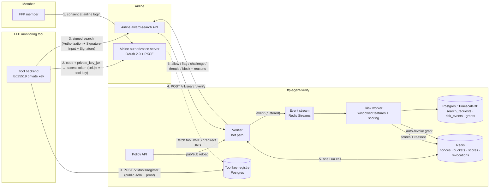

# Architecture

## What the system decides

Every award search an airline receives falls into one of two **lanes**:

| Lane | How we know | What we're separating | Main evidence |
|---|---|---|---|
| **Authenticated** | Request carries an airline-issued access token and an Ed25519 HTTP Message Signature | *Well-behaved* authorized tools from *misbehaving* ones (quota abuse, credential resale, stolen keys, turncoats) | Cryptography first, then behavior compared with the airline's policy |
| **Unauthenticated** | No credentials | Humans from bots that didn't bother to authorize | Header / client heuristics, velocity, cross-airline coverage, the airline's own edge bot score |

Many "tool-vs-human" signals (24/7 activity, 6+ airlines, near-zero booking conversion) describe a *legitimate authorized tool* by definition. They are **not** penalized in the authenticated lane. Penalizing them is where false positives against good tools come from.

## Components and data flow

1. **Tool registration.** The tool registers its Ed25519 public key with us and signs a challenge to prove it holds the private key. Its `jkt` (RFC 7638 thumbprint) becomes the signature `keyid`.
2. **Member authorization (airline is the AS).** The member logs in at the airline and approves the tool. The authorization request carries `dpop_jkt` (RFC 9449). The tool authenticates at the token endpoint with `private_key_jwt` (RFC 7523) using that same key. The airline issues a 5–15 minute JWT with `cnf.jkt`, `client_id`, `auth_time` and, optionally, `ffp_routes`. Refresh tokens rotate on every use.
3. **Signed search.** Each search carries the bearer token plus an RFC 9421 signature covering `@method @authority @path @query authorization`. This is the same scheme as Web Bot Auth, so CDNs that verify it can do so at the edge.
4. **Verify call.** The airline forwards method, URL, headers, client IP, the parsed search, and any client signals it has: a device id, `navigator.webdriver`, or an edge bot score.
5. **Hot path.** See below.
6. **Decision and reasons.** The decision goes back to the airline, which acts on it and passes `reasons` to the tool. Reasons are written for tool developers, not just for the airline.

## Hot path: latency budget

The target is under 50 ms end to end. Measured server-side verification is p50 0.7 ms and p99 3.9 ms at 2,000 req/s (see [results.md](results.md)).

| Step | Where | Cost |
|---|---|---|
| Parse + RFC 9421 base reconstruction | in-process | ~40 µs |
| Ed25519 verify | in-process (OpenSSL via `cryptography`) | ~100 µs |
| JWT verify | in-process, **cached per token**, so once per token per replica, not per request | ~0 µs amortized |
| Key binding, client binding, route scope, airline policy | in-process (registry kept fresh via pub/sub) | ~10 µs |
| Nonce `SET NX` + revocation check + two token buckets + cached grant/tool scores | **one** Redis Lua script, keys hash-tagged `{t:<tool_id>}` so it's single-shard in Cluster | 1 RTT (~0.2 ms same-AZ) |
| Combine cached score with request-local evidence | in-process | ~10 µs |
| Event emission | appended to an in-memory buffer, flushed to Redis Streams every 20 ms in batches | ~1 µs |

There's no Postgres on the hot path and no model inference. Behavioral scoring runs **one request behind**: the worker's latest score for this grant / IP / device is read from Redis and folded in. A tool that turns adversarial is caught within seconds (simulation: credential fan-out blocked in 2.4 s, turncoat in 9 s).

### Failure behavior

- **Redis budget** (`redis_timeout_ms`, default 20). Past the budget the verifier decides *without* Redis according to the airline's `fail_mode` (`open` = allow, `closed` = block), and marks the response `degraded: true`. The Redis call is **not cancelled**: cancelling forces redis-py to drop the connection, and under load that becomes a reconnect storm (measured: 95% degraded before this change, ~5% after).
- **Checks that don't need Redis still apply when degraded.** These are the crypto, token, key-binding, route-scope and policy checks, plus header heuristics in the unauthenticated lane. A forged signature or a `python-requests` scraper is blocked even with Redis down.
- **Postgres outage.** Verification is unaffected. The worker's batch fails and is retried from the stream, and admin APIs return errors.

## Cold path: risk worker

The worker consumes the event stream through a consumer group, so you can run N replicas. Per batch it does four things:

1. **Updates sliding-window features in Redis**, keyed by event time, which is why simulations can run faster than real time:
   - per grant: searches/60 s, IP changes/5 min, distinct IPs/60 s, tools per member, grant age;
   - per tool: *attributable* verification failures/5 min;
   - per IP: searches/60 s, airlines/10 min, distinct first-party devices/10 min;
   - per device: searches/60 s, IP changes/5 min.
2. **Rescores every touched entity** with the airline's policy, using the pure functions in `risk/scorer.py`.
3. **Writes `{score, reasons}`** where the hot path reads them, and **auto-revokes a grant** whose score reaches the airline's `revoke` threshold.
4. **Persists** `search_requests` (a TimescaleDB hypertable), `risk_events` (anything other than allow, plus revocations), `grants`, `credentials` and tool `last_seen` / `risk_score`.

Only requests that **passed authentication** update a grant's behavioral features. Blocked traffic carrying a grant's identity could be someone else's (a replayer, say), and letting it count would let attackers frame legitimate tools. The simulator caught exactly this.

## Data model

See [`src/ffpverify/schema.sql`](../src/ffpverify/schema.sql). The FFP-specific choices:

- `grants` is the long-lived thing (member × tool × airline). `credentials` are the short-lived JWTs seen under it, with `usage_count` and `ip_history`.
- `member_ref = sha256(airline:sub)`. We never store FFP numbers.
- `search_requests` stores route (`origin`, `destination`, `travel_date`, `cabin`) and the decision, score, reason codes and verify latency for each search. Route-repetition and time-of-day analytics come from this table.
- `airline_policy_versions` keeps every policy change for audit and rollback.

## Answers to the design questions

**How do we stop bots from obtaining credentials?** Credentials require an FFP member login *at the airline*, so the airline's existing account security and KYC is the gate. On top of that: a per-member cap on tools (`max_tools_per_member` feeds the `credential_sharing` signal), reduced quotas for young grants (`min_grant_age_s` and `new_grant_rate_factor`), and per-tool aggregate quotas, so a farm of fake members doesn't scale linearly.

**How do we detect credential sharing or resale?** One grant used from several IPs at once (`ip_concurrency`), fast rotation (`ip_churn`), velocity over quota, and one member authorizing many tools (`credential_sharing`). In simulation, a grant fanned out to 8 workers was auto-revoked in 2.4 s. Tokens are key-bound (`cnf.jkt`), so a stolen token is useless without the tool's private key, and signatures carry single-use nonces.

**What about tools that start legitimate but turn adversarial?** Scores are recomputed continuously over sliding windows, and the hot path always reads the latest. Thresholds escalate from flag to throttle to block to auto-revoke (per grant). Tool-wide revocation is available to the tool itself (key compromise) and to admins. Airlines can revoke individual grants.

**What's the minimum viable signal set?** For the authenticated lane, crypto plus velocity, IP churn, IP concurrency and grant age. In simulation that blocked every authenticated attack scenario with 0% false positives on authorized tools. For the unauthenticated lane, automation headers plus velocity cover the unsophisticated bulk. Stealthy scrapers need edge signals; see the known gaps in [results.md](results.md).

**How do we make this latency-neutral?** Single-RTT Redis, in-process crypto with cached token verification, scoring off the hot path, non-cancelling timeouts with an explicit fail mode, and deployment next to the airline API. The network hop to the verifier is the largest cost, so co-locate it (same VPC or region), or run the stateless crypto checks at the edge (Workers / Lambda@Edge) and keep the Redis call regional.

## Scaling notes

- **CPU.** About 0.4 ms of Python CPU per verification in-process, plus about 0.4 ms of HTTP/JSON framework overhead. On a 12-core laptop that was also running the load generator and the Docker VM, 6 workers sustained ~1,900 req/s with a 12 ms client p99, and saturated at ~5,800 req/s. For production, plan on roughly 1,000 req/s per vCPU at 50% target utilization. The hot path (`verify.py`, `httpsig.py`, `store.py` Lua) is isolated so it can move to Node, Go or a Cloudflare Worker if per-request CPU matters.
- **Redis.** Every hot-path operation is O(1) and authenticated-lane keys share a hash tag per tool. A single primary handles roughly 100k verify/s, and Redis Cluster can shard by tool.
- **Worker.** Batched pipelines, with throughput bounded mainly by Postgres `COPY`. Add replicas to the consumer group.
